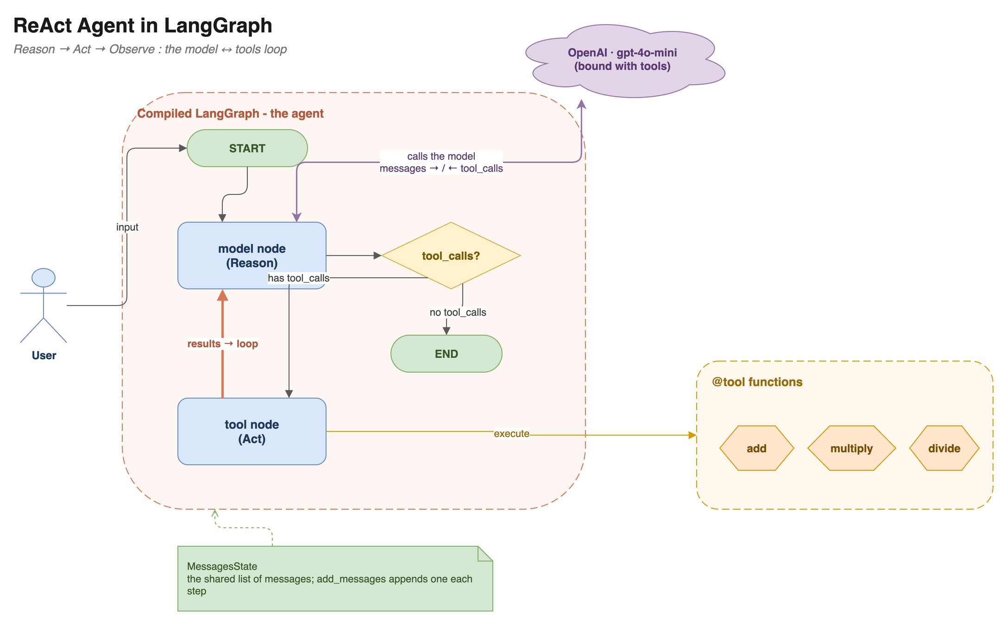
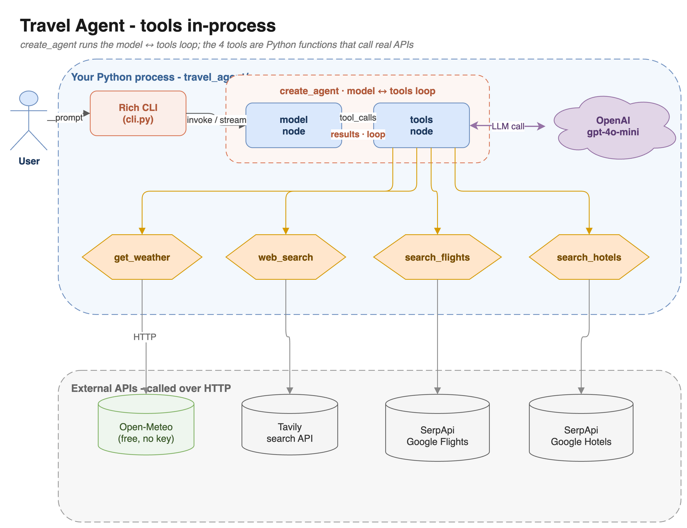
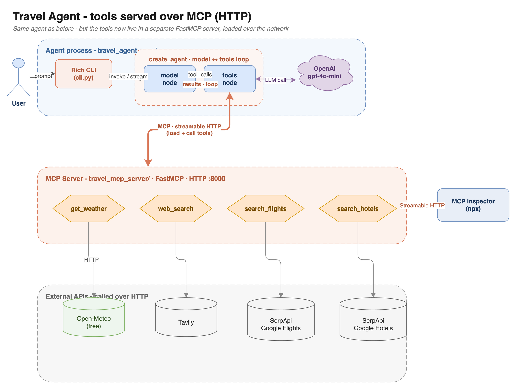

# 🧭 Building Agents with LangGraph

A hands-on workshop that takes you from *"what is an agent?"* to a **real, tool-using travel agent** -
first with in-process tools, then with the same tools served over an **MCP server**. Along the way you
learn **persistence** (memory) and **streaming**.

Everything is runnable, tested end-to-end, and managed with [uv](https://docs.astral.sh/uv/) +
[just](https://github.com/casey/just).

```text
01 build a ReAct agent  →  02 use it (Travel Agent)  →  03 tools over MCP  →  04 memory  →  05 streaming
```

---

## What you'll learn

- **How an agent actually works** - build the ReAct `model ↔ tools` loop from raw nodes, then collapse
  it into `create_agent`.
- **`MessagesState`** and the `add_messages` reducer (not just plain `StateGraph`).
- **Tools** - real APIs (weather, web search, flights, hotels), with example-rich, self-documenting hints.
- **MCP** - move your tools into a standalone **FastMCP server** (HTTP) and load them over the network.
- **Persistence** - threads, checkpointers, time-travel, `update_state`.
- **Streaming** - `updates` / `values` / `messages` / `custom`, token streaming, `astream_events`.

---

## Learning path (notebooks)

| # | notebook | what it covers |
|---|----------|----------------|
| 1 | [`01_agents.ipynb`](01_agents.ipynb) | Build a **ReAct agent** from scratch: `MessagesState`, the LLM node + tool node (line by line), the loop, then `ToolNode` and `create_agent`. |
| 2 | [`02_travel_agent.ipynb`](02_travel_agent.ipynb) + [`travel_agent/`](travel_agent) | A real agent with **4 tools** (weather, web search, flights, hotels). Per-tool tests, an API map, a formatted decision trace, full flow. |
| 3 | [`03_travel_agent_mcp.ipynb`](03_travel_agent_mcp.ipynb) + [`travel_mcp_server/`](travel_mcp_server) + [`travel_agent_mcp/`](travel_agent_mcp) | Move the same tools into a **FastMCP server** (HTTP) and load them over MCP. Same agent, decoupled tools. |
| 4 | [`04_persistence.ipynb`](04_persistence.ipynb) | The **checkpointer**: threads, `get_state`, history, time-travel, `update_state`, SqliteSaver. |
| 5 | [`05_streaming.ipynb`](05_streaming.ipynb) | **Streaming**: stream modes, token-by-token output, custom events, `astream_events`. |

---

## Architecture

### 1 · The ReAct agent (notebook 01)

The agent is two nodes and a loop: the **model** reasons (and may request tools), the **tool node**
acts, and the result flows back to the model until it produces a final answer.



### 2 · Travel Agent - tools in-process (notebook 02)

`create_agent` wires the model-tools loop; the four tools are plain Python functions that call real
APIs from inside your process.



### 3 · Travel Agent - tools over MCP (notebook 03)

The exact same agent, but the tools now live in a standalone **MCP server** reached over HTTP. The
agent loads them with `langchain-mcp-adapters`; the **MCP Inspector** can poke the same server.



> The `.drawio` sources are in [`diagrams/`](diagrams) - open them in the draw.io app to edit.

---

## Quickstart

1. **Install tooling** (once):

   ```bash
   # uv: https://docs.astral.sh/uv/getting-started/installation/
   brew install just          # short commands
   ```

2. **Create the environment** (installs the exact pinned versions from `uv.lock`):

   ```bash
   just sync                  # = uv sync
   ```

3. **Add your API keys** to `.env` in the repo root (already git-ignored):

   ```env
   OPENAI_API_KEY=sk-...
   TAVILY_API_KEY=tvly-...
   SERPAPI_API_KEY=...        # only needed for the flight/hotel tools
   ```

4. **Run the notebooks**:

   ```bash
   just start                 # launch Jupyter Lab
   ```
   Pick the **`Python (langgraph-workshop)`** kernel.

---

## Commands

Short `just` commands wrap the uv environment so you never type `uv run ...`. Full reference:
[`COMMANDS.md`](COMMANDS.md).

| command | what it does |
|---------|--------------|
| `just` | list all commands |
| `just sync` | install / update the environment |
| `just start` | launch Jupyter Lab (aliases: `lab`, `launch`) |
| `just cli` | run the Travel Agent CLI (in-process tools) |
| `just mcp` | start the MCP tool server (HTTP, `:8000`) |
| `just mcp-cli` | run the Travel Agent that loads tools over MCP |
| `just inspector` | open the MCP Inspector |
| `just kernel` | (re)register the Jupyter kernel |

**MCP demo** (two terminals):

```bash
just mcp        # terminal 1 - the tool server
just mcp-cli    # terminal 2 - the agent
```

The CLI shows the agent's decisions live (Claude-Code-style) and renders the answer as Markdown:

```text
›  Plan a 5-day trip to Tokyo in October from Chicago, budget $3000.
─────────────────────────────────────────────
⏺ flights   search_flights(origin='ORD', destination='NRT', outbound_date='2026-10-01')
⏺ web search web_search(query='best food and temples in Tokyo')
⏺ hotels    search_hotels(location='Tokyo', check_in_date='2026-10-01', ...)
  ⎿  Flights ORD -> NRT on 2026-10-01: $1365 | EVA Air | 1 stop ...

╭─ ✻ Wanderlust ──────────────────────────────
│  Here's a 5-day Tokyo trip within your $3000 budget …
```

---

## Repo structure

```text
langgrapgh-agent/
├── 01_agents.ipynb            # ReAct agent from scratch
├── 02_travel_agent.ipynb      # Travel Agent (in-process tools)
├── 03_travel_agent_mcp.ipynb  # Travel Agent (tools via MCP)
├── 04_persistence.ipynb       # checkpointer / memory
├── 05_streaming.ipynb         # streaming
│
├── travel_agent/              # in-process Travel Agent (tools.py, agent.py, cli.py)
├── travel_mcp_server/         # FastMCP server exposing the 4 tools over HTTP
├── travel_agent_mcp/          # same agent, tools loaded over MCP
│
├── diagrams/                  # .drawio sources + exported PNGs
├── images/                    # diagrams pulled from the LangChain docs
│
├── pyproject.toml / uv.lock   # pinned environment
├── justfile                   # short commands
├── COMMANDS.md                # full command reference
└── .env                       # your API keys (git-ignored)
```

---

## How the agent works (in one paragraph)

`create_agent(model, tools, system_prompt)` compiles a LangGraph with two nodes - **`model`** and
**`tools`** - plus a router. The model is called with the running `messages`; if it returns
`tool_calls`, the router sends them to the `tools` node, whose results are appended to the conversation
and fed back to the model. This repeats until the model answers with no tool calls. That's the entire
ReAct loop - notebook 01 builds it by hand so nothing is magic.

The Travel Agent's system prompt is **date-aware and self-correcting**: it's rebuilt each run with
today's date (so "October" means a *future* October), infers IATA airport codes from city names, and
retries when a tool reports a problem (e.g. a past date).

---

## Notes & troubleshooting

- **`ModuleNotFoundError` in a notebook** → you're on the wrong kernel. Pick **`Python (langgraph-workshop)`**,
  or run via `just` / `uv run` (the project `.venv`).
- **MCP `ConnectError`** → the server isn't running. Start it first: `just mcp` (or run the notebook's
  "Start the server" cell).
- **Models**: uses OpenAI `gpt-4o-mini`. (Docs' `gpt-5.4` / Anthropic examples are adapted to OpenAI.)
- **Streaming**: uses the stable `stream_mode=` / `astream_events(version="v2")` API. The docs' newer
  `stream_events(version="v3")` is shown as a preview but isn't in the released packages yet.
- **`.env`** loads by absolute path in every notebook's first cell, so keys work regardless of where
  Jupyter was launched.

---

## Built with

LangGraph · LangChain · `create_agent` · FastMCP · langchain-mcp-adapters · OpenAI `gpt-4o-mini` ·
Tavily · SerpApi · Open-Meteo · uv · just · rich
